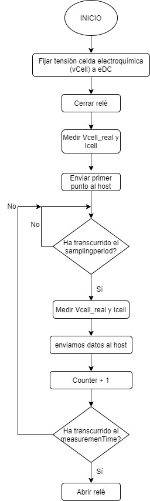

# Proyecto MASB: Programación de un Potenciostato

**Miembros del proyecto**: Marc Palomer (miembro A) i Laia Borrell (miembro B). 

**Curso**: Microcontroladores para Aplicaciones y Sistemas Biomédicos (MASB), Ingeniería Biomédica UB.

## Tabla de contenidos

* [Introducción](#Hola1)
  * [Qué és un potencionstato](#Hola2)
  * [Medidas electroquímicas realizadas](#Hola3)
    * [Voltametría Cíclica (CV)](#Hola4)
    * [Cronoamperometria (CA)](#Hola5)
* [Objetivos](#Objetivos)
* [Metodología](#Metodologia)
  * [Applicación final](#app final)
    * [Flujo operativo del usuario con el dispositivo](#user)
    * [Flujo operativo del microcontrolador](#micro)
    * [Flujo operativo de la CA](#flujoCA)
    * [Flujo operativo de la CV](#flujoCV)
  * [Organización de tareas](#tareas)
  * [Estructura del repositorio de git](#git)
* [Resultados](#Resultados)
* [Conclusiones](#Conclusiones)

# Introducción <Hola1>

El proyecto presentado consiste en la **programación de un potenciostato a partir de la EV Nucleo-F401R de STMicroelectroncs**. La finalidad de este és la caracterización de la concentración de varias disoluciones de Ferricianuro de potasio en un tampón de cloruro de potasio por medio del potenciostato. Para ello se han programado dos medidas: una cronoamperometría (CA) y una voltametría cíclica (CV).

Primeramente se introducen los parametros deseados asi como el tipo de medida (CA/CV) en el software ViSense, programado especialmente para el proyecto. Els sensor combinado con la EV toman las medidas y estas son enviadas al ordenador, que las muestra en forma de datos o grafica en el software ViSense. 

## ¿Qué es un potenciostato?<Hola2>

Un potenciostato es un dispositivo que mide y amplifica una señal proveniente de una reacción electroquímica, permitiendo medir las concentraciones de un analito.

Un potenciostato cualquiera puede medir en modo amperométrico, donde se fija el potencial y se mira la corriente de salida, o potenciométrico, donde se fija la corriente y se mira el voltage.  En este proyecto estamos trabajando en modo **amperométrico**, fijando el voltaje de la celda (*Vcell*) y midiendo la corriente (*Icell*). 

Las configuraciones típicas para sensores amperométricos, que miden la corriente que sale de una reacción electroquímica, consisten en un enfoque de dos electrodos, donde hay un electrodo de trabajo en que tiene lugar la reacción y un electrodo de referencia junto con un electrodo auxiliar, que rastrean el potencial resultante de la reacción y proporcionan la corriente requerida. Sin embargo, este enfoque presenta un problema que se basa en la acumulación de cargas en el electrodo de referencia, que debe tener un potencial bien conocido. Para solucionar este problema, se define la configuración de tres electrodos:

* <u>Electrodo de trabajo (WE)</u>: el electrodo de trabajo es aquel donde se produce la reacción Electroquímica, cambiando la tensión del electrodo.
* <u>Electrodo de referencia (RE)</u>: se utiliza para medir cambios en el potencial del electrodo de trabajo.
* <u>Electrodo auxiliar (AE)</u>: Suministra la corriente necesaria para la reacción electroquímica en el electrodo de trabajo.

> Celda electroquímica, configuración de 3 electrodos.[[Fuente](#https://www.intechopen.com/books/state-of-the-art-in-biosensors-general-aspects/bioelectronics-for-amperometric-biosensors)]

## Medidas electroquímicas realizadas <Hola3>

A continuación se explica en que consisten las dos medidas programadas en este proyecto.

### Voltametría cíclica <Hola4>
Una **Voltammetría Cíclica** es un tipo de medición electroquímica potenciodinámica en la que se aplica un potencial variable a una celda electroquímica mientras se mide la corriente que esta celda proporciona. El potencial entre el electrodo de trabajo (WE) y el de referencia (RE) de la celda varía con el tiempo hasta que alcanza un valor potencial establecido, luego cambia de dirección, realizando lo que se denomina barrido triangular de potencial. Este proceso se repite durante un número establecido de ciclos. El resultado se representa en un voltamograma cíclico, que representa la corriente a través de la celda frente al voltaje aplicado en esta. La CV es una técnica ampliamente utilizada para estudiar las propiedades electroquímicas de un analito en una solución. Una CV proporciona gran cantidad de información sobre el comportamiento químico y físico de un sistema. Además, se pueden observar diferentes fenómenos físicos realizando voltammetrías a diferentes velocidades de exploración (modificando la velocidad de cambio de voltaje con el tiempo).

(Insertar imatge de voltatge vs temps)

### Cronoamperometría <Hola5>
Una Cronoamperometría (CA) es una técnica electroquímica que transduce la actividad de las especies biomoleculares de una celda electroquímica en una señal de corriente que cuantifica la concentración del analito de interés. En esta técnica se aplica una señal escalón y se mide la corriente a través de la celda en función del tiempo. Una de las ventajas de esta técnica es que no requiere etiquetado de analito o biorreceptor. El experimento comienza manteniendo la celda a un potencial en el que no ocurre ningún proceso faradaico. Entonces, el potencial se eleva a un valor en el cual ocurre una reacción redox.*

## Objetivos<Objetivos>

* Programar un potenciostato portable
* Controlar la Power Management Unit del módulo front-end del potenciostato (REVISAR)
* Comunicarse con la aplicación *ViSense-S*.
* Implementar una voltametría cíclica.
* Implementar una cronoamperometría.

## METODOLOGÍA<Metodologia>

### Aplicación final <app final>

En esta sección se presentan una serie de diagramas de flujo que ejemplifican el código programado en STM32CUBE para implementar el potenciostato portable.

#### Flujo del usuario con el dispositivo <user>

El usuario deberá abrir la aplicación de escritorio **viSens.S**  y seguidamente conectar con el dispositivo. Entonces seleccionará la técnica electroquímica que quiera realizar, CV o CA, y configurará los respectivos parámetros.

<u>Parámetros CA:</u>

* `eDC` (*double*): potencial constante de la celda electroquímica durante la CA en voltios.
* `samplingPeriodMs`(*uint32_t*):  tiempo en ms entre cada punto tomado.
* `measurementTime`(*uint32_t*): duración (en segundos) de la CA.

<u>Parámetros CV</u>:

* `eBegin`(*double*): potencial de celda en el que se inicia la voltametría cíclica. El potencial de la celda electroquímica se lleva del potencial de inicio al vértice de potencial 1. También indica el potencial en el que finalizará la voltametría cíclica.
* etc (acabar)

Una vez configurados los parámetros iniciará la medición. El dispositivo recibirá los parámetros configurados y empezará a tomar puntos, los cuales ira enviando al usuario hasta que termine la medición. Si se quiere iniciar una nueva medida se debe reiniciar el proceso, empezando por seleccionar la técnica correspondiente. En caso contrario se cierra la aplicación.

**CANVIAR EL DIAGRAMA, BORRAR LO DE QUE SEA PARADA POR EL USUARIO (es pot fer amb recortes**

> Flujo de operación del usuario con el dispositivo y Visens-S. [Fuente: readme proporcionado por la asignatura].

#### Flujo operativo del microcontrolador <micro>

*explicar*

#### Flujo operativo de la CA <flujoCA>

*explicar*

#### Flujo operativo de la CV <flujoCV>

*explicar*

### Organización de tareas <tareas>

Teniendo en cuenta los objetivos mencionados, el trabajo se ha repartido equitativamente entre los dos miembros que han desarrollado el proyecto. 

Tanto la <u>cronoamperometría</u> como la <u>voltametría</u>, en este orden, se han programado de forma conjunta en reuniones presenciales. Después, las demás tareas se han repartido de la siguiente forma:

* El <u>miembro B</u> ha configurado el fichero  `.ioc` y ha generado el código. También ha generado las funciones `setup()` y `loop`  y las ha incluido en el archivo `main.c`, modificándolo. Finalmente se ha encargado de la gestión de los *timers*.
* El <u>miembro A</u> se ha encargado de la gestión del *DAC*, del control de la *PMU* y de gestionar las conversiones con *ADC*. También se ha encargado de la organización de git, estructurando las distintas ramas del repositorio.

### Estructura del repositorio de git <git>

El repositorio git en que se ha desarrollado el proyecto seguía la siguiente estructura de ramas:

> Estructura de ramas del repositorio git. [Fuente: propia]

* **Master**: esta rama contiene el código final de producción, cuya funcionalidad está 100% terminada.
* **Develop**: rama con el desarrollo colectivo. En esta rama van agrupándose los desarrollos individuales y se hacen las pruebas o testeos de la aplicación. Des de esta rama se han configurado los ficheros `.ioc`  y `main.c`. Una vez funcionando correctamente, sus contenidos de vierten en la rama `master`con un `Pull request` definitivo. 
* **feature/CA**: esta rama contiene el desarrollo de la funcionalidad de la cronoamperometría. Tanto el fichero `.h` como el `.c` referentes a la CA se han desarrollado des de esta rama. Una vez listos la rama se ha volcado a la`develop ` mediant un `Pull request`. 
* **feature/CV2**:  esta rama contiene el desarrollo de la funcionalidad de la voltametría cíclica. Tanto el fichero `.h` como el `.c` referentes a la CV se han desarrollado des de esta rama. Una vez listos la rama se ha volcado a la rama `develop ` mediant un `Pull request`.  Esta rama lleva el nombre `/CV2` debido a que una rama anteriormente creada llamada `feature/CV` ha quedado inutilizada.
* **feature/setupLoop**: esta rama contiene el desarrollo de las funciones `setup()` y `loop()` desarrolladas en los archivos `stm32main.c` y `stm32main.h`. Una vez listos, el contenido de la rama se ha vertido a la rama `develop` mediante un `Pull request`.
* **feature/readme**: des de esta rama se han creado y modificado los archivos `REPORT_ES` y `REPORT_EN` , que contienen los reports en castellano e inglés, respectivamente, del proyecto realizado. Una vez terminados se han volcado a la rama `develop` mediante un `Pull request` .
* **hotfix/ad5280-rtia**: rama donde se ha corregido un error respecto... no ho sé preguntar.

Lo más complicado del proyecto han sido los siguientes dos aspectos (**ACABAR!!!**):

1) tot el tema de les variables repetides a la crono i la CV i implementar la CV per a que pugues agafar vertexs tan positius com negatius

2) control de les branques de git

## RESULTADOS<Resultados>

-Ficar els resultats de les proves (Screens), i també el del experiment real

## CONCLUSIONES<Conclusiones>

  -Discussió del nostre pas per la asignatura, el que hem apres i el que no etc que hem apres del potenciostat etc